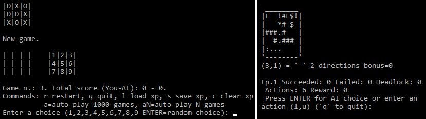
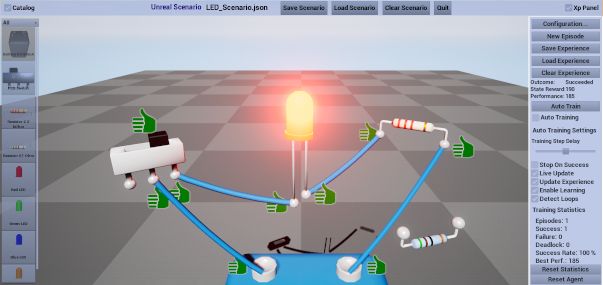

# Digital Scenario Framework

Digital Scenario Framework is a trial to study the cooperation between human and [artificial intelligence (**AI**)](#references "AI: Its Nature and Future") applied to a generic digital scenario. A digital scenario can be defined as a computer simulation of a proposed context and series of events.
This project includes a programming interface for digital scenarios, providing some features including:
* scenario data (entities, relationships, environment, temporal sequence);
* experience management (capturing, storing and reusing experience);
* [machine learning](#references "The Discipline of Machine Learning") (tasks learning by [reinforcement learning, **RL**](#references "Reinforcement Learning: An Introduction")).

**Please note that this project is a work in progress, mainly designed for research purposes, not for software production.** This project was originally created to experiment with RL algorithms, thus it is mainly focused on understanding RL, leaving further features and optimizations to possible future developments.

## Overview

### Motivation

##### Human-AI cooperation
Even if modern AI systems are efficient and greatly faster than humans in performing some specific tasks, they cannot replace human intelligence, mainly because [they do not "understand" the world](#references "Artificial Unintelligence. How Computers Misunderstand the World"). An interesting approach is "*a collaborative path forward that pairs the best of human effort with the best of machine effort. Humans plus machines outperform humans alone or machines alone.*" ([Meredith Broussard](#references "Artificial Unintelligence. How Computers Misunderstand the World"))

This project could become a kind of laboratory for studying a cooperation between AI systems and humans in performing tasks, where the experience can be acquired, stored and shared both by an AI system and a human user.

##### Research & Education
Trying to implement a RL application is a useful way to understand that *"Applications of reinforcement learning are still far from routine and typically require as much art as science. Making applications easier and more straightforward is one of the goals of current research in reinforcement learning."* ([Sutton & Barto, 2018](#references "Reinforcement Learning: An Introduction")).

The *Digital Scenario Framework* tries to be an initial step to build a framework that make testing RL algorithms easier, in particular for AI beginners, with some programming experience, who want to understand how RL works.

### Key concepts

In *Digital Scenario Framework* is composed by some decoupled modules, working together to provide a generic solution for different scenarios. Each module includes a set of components, described hereafter.  

#### Digital scenario

In order to a describe a generic digital scenario an object-oriented model was created. Using this scenario definition a Virtual Environment (**VE**) can be configured, observed and controlled  using an abstraction layer to decouple the framework from specific VEs. This application programming interface (API) is also exposed to the VE to update the digital scenario according to the interactions inside the VE.
Types of entities can be stored in a *Catalog* that can be used to instantiate new entities in the scenario.

#### Simulation facility

A temporal sequence based data model is available for simulation control. Basic simulation data can be stored and used to control entities (e.g. to animate virtual objects in a VE). 

#### Virtual Environment

A VE can be used as interface for the visualization and the interaction with digital scenarios, thanks to a proper API (Application Programming Interface) to a generic game engine (see [Related Projects](#related-projects)). This framework is anyway independent from a specific game engine (console-based examples are provided to demonstrate that there is no need at all for a game engine).

#### Cyber system

A connection can be implemented between a digital scenario and a cyber system (a system with computation, communication and control capabilities), thanks to the definition of a generic *Cyber System Interface*.
The implementation of such interface can be chosen and loaded at run-time.

#### Assistant
The *Digital Assistant* is able to memorize system states, actions and their results, then it can reuse the acquired experience to assist the user in performing tasks. The interaction with the VE is supported by this digital assistant.
A *Cyber System Assistant* is a digital assistant able to interact with a cyber system.

#### Experience management

The experience is the memory of past episodes and their outcomes that can be managed by the *Digital Assistant*, an aid for computer-assisted tasks. It tracks activity, storing scenario states and actions into the experience data. After some tasks are completed, considering both successful and failed episodes, it can suggest a sequence of successful actions or it can warn about forbidden actions.

#### Reinforcement learning

Even if the stored experience can be always improved by an expert human user, an automatic training can be useful, both for finding a successful sequence of actions for unknown tasks and for detecting actions that lead to a failure. 

#### Cyber System Agent

The *Cyber System Agent* is a kind of *Cyber System Assistant* that can build its experience from direct interaction with its environment thanks to a RL algorithm. Actions can be taken autonomously by the agent, according to its policy, or chosen by the user. In both cases, the agent can learn from the result of its actions and improve its future performance.

#### Multi-agent interaction

This framework allows creating "shared arenas", where a group of "actors" interact with the same environment, a digital scenario in a well defined state.
Each "actor" is in fact a *Digital Assistant*, with its own goal and its own experience.
The actors in a *Shared Arena* can be also *Cyber System Agents*.
These agents detect changes of the environment each time an action is done, thus they all observe the same scenario state and control the same cyber system, learning to take actions that enable them to achieve their goal.

### Features summary

* **Digital Scenario**
  - Scenario data structures
  - Catalog definition
  - Data serialization
  - Scenario API for interoperability
  - VE API for interoperability
  - Temporal sequence based data model for simulation control

* **Cyber system**
  - Common programming interface definition
  - Rules definition (success/failure/deadlock conditions, roles management)
  - Cyber system configuration via text parameter
  - Independent system implementation
  - Run time loading

* **Experience**
  - Higher level entity states and features
  - Episodes evaluation and memorization
  - Suggestions based on stored experience
  - Interface to a generic cyber system

* **Reinforcement Learning**
  - Internal Reinforcement Learning (RL) algorithm
  - Interaction with a generic cyber system
  - Interaction with experience management
  - Generic interface definition for custom RL agents

* **Multi-agent interaction**
  - Role definition
  - Shared arena

* **Interoperability**
  - Dynamic link library
  - C-style wrapper for multi-platform support
  - binding for .NET/C# (external project, see [Related Projects](#related-projects))

### Examples

In order to test the multi-agent support a console-based program was developed, implementing the tic-tac-toe game. This example can be run in two modes: RL agent versus RL agent or RL agent versus human user.

To test a custom agent implementation, the classic gridworld example is provided as a console application. The Gridworld test can be run in two ways: automatic (a RL agent acts autonomously) or manual (the user can move the agent along the grid).

  

*Console-based examples.*

Another console-based program was developed to test computer-assisted tasks. A simple schema of the electronic circuit can be displayed and timings and statistics are computed and displayed to compare different settings.
A simplified model of an electronic circuit was used to build this and other examples, also with a VE as user interface (see [Related Projects](#related-projects)).

## Architecture
### Overview
The *Digital Scenario Framework* includes a set of C++ libraries composed by different components:
* digital **scenario** definition and modification;
* conceptual model and task-related **experience** management;
* **cyber system** implementation;
* **RL agent** implementation.

This repository includes some projects: the core framework, some examples of cyber systems, a custom agent and a console-based test application.

### Platforms

This framework was developed with Microsoft [Visual Studio] 2015 and [Code::Blocks] 20 on Windows platform and can be built both for 32 bit and 64 bit platforms.
Attention was paid to write a portable code (hopefully compliant with any compiler supporting C++ 14), thus it would be possible to port the framework to other platforms (e.g. Linux). Further contributions from the developer community are required for this porting.

### Dependencies

This framework uses [boost] (version 1.70.0, *filesystem*, *date_time* and *dll* libraries) and [rapidjson] (version 1.1.0) libraries  (see [this document](./DEPENDENCIES.md) for details).

### Interoperability

This framework can be linked as dynamic linking library (DLL) in two ways: using the framework from a C++ application (mainly via the *DigitalScenarioFramework* API) or from any other programming language (thanks to a proper wrapper). 
The C++/STL language used by the framework cannot be used directly from other client applications written in other languages. For this reason a wrapper was developed with a C-style programming interface that can be used in any platform, assuming suitable binaries for the library are provided.

## Documentation

The reference documentation can be generated with [Doxygen].

Instructions about building the framework and its dependencies can be found [here](./HOW_TO_BUILD.md).

A tutorial to learn how to work with the framework is available [here](./TUTORIAL.md).

## Related projects

**Note:** When working with other testing environments ([UnrealScenarioTest]/[UnityDigitalScenarioTest]) it is possible in [Visual Studio] to automatically update binaries in the project folders: just set `UE4TEST_ROOT` and/or `UNITY_TEST_ROOT` in `DSF_deploy.props` to the paths of UE4 and Unity test projects.

### Digital Scenario Framework Test for Unreal Engine

In order to test the framework with a specific game engine, a sample implementation is provided using [Unreal Engine 4]: **[UnrealScenarioTest]**.
The *Digital Scenario Framework* library can be directly linked by an Unreal Engine project, thanks to the common C++ programming language. The sample implementation consists of a set of a function library for generic utility functions and a set of actors:
* a main *Actor* to control the integration with the Digital Scenario Framework;
* one (or more) *Catalog Actors*, containing the references to assets defined in the project or in the scene;
* some *Entity Actors* to implement the behavior of entities defined in the framework;
* some *Entity Components* to store data defined in the framework;
* some *Entity State Components* to define the behavior related to entity state changes;
* a sample scene (Unreal map with related assets) to test the framework.

*[UnrealScenarioTest]* project can be targeted on Unreal Engine supported platforms, but is only tested on Windows platform at the moment (contributions for other platforms from the developers community are welcome).

 

*A screenshot from the Digital Scenario Framework Test for Unreal Engine.*

### Digital Scenario Framework for .NET

A wrapper for .NET platform (*[DigitalScenarioFrameworkNET]*) was developed in order to test the framework also with Unity, another popular game engine based on .NET/C# as scripting language. Please note that **this API is still incomplete**.

###  Digital Scenario Framework Test for Unity

The **[UnityDigitalScenarioTest]** project is a [Unity] project based on the Digital Scenario Framework for .NET (*[DigitalScenarioFrameworkNET]*). This project is based on the simplified electronic circuit test case. Specific behavior of electronic components were implemented as visual effects, like lighting up a LED or moving a switch cursor.
A point-and-click interaction was implemented to connect electronic components and to activate switches. Cables are automatically created and added to the scene to show the connections among electronic components. Electronic components can be selected and dragged to change their positions. 
A user interface was developed to load and save the scenario configuration, to control the experience management, to test the automatic training and to define goals and success conditions. Please note that **this project has less features than UnrealScenarioTest** (development is more complicated because of the translation layers needed: C# - C wrapper - C++).

## References

A good introduction to AI:

**Margaret A. Boden (2016) *AI: Its Nature and Future*, Oxford University Press, Oxford, UK. ISBN: 978-0-19-877798-4.**

(Italian edition: Margaret A. Boden, *L'Intelligenza Artificiale*, Il Mulino, Bologna, Italy, 2019. ISBN: 978-88-15-28095-4)

An interesting perspective on AI:

**Meredith Broussard (2019) *Artificial Unintelligence. How Computers Misunderstand the World*, MIT Press, Cambridge, MA, USA. ISBN: 9780262537018.**

(Italian edition: Meredith Broussard, *La non intelligenza artificiale. Come i computer non capiscono il mondo*, FrancoAngeli srl, Milano, Italy, 2019. ISBN: 9788891789631)

An introduction to ML:

[**Tom M. Mitchell (2006) *The Discipline of Machine Learning*, Machine Learning Department, School of Computer Science, Carnegie Mellon University, Pittsburgh, PA, USA.**](http://reports-archive.adm.cs.cmu.edu/anon/ml/abstracts/06-108.html)

A reference book for Reinforcement Learning:

**R.S. Sutton & A.G. Barto (2018, 2020) *Reinforcement Learning: An Introduction*. Second edition. The MIT Press, Cambridge, MA, USA. ISBN: 9780262039246.**

## Licensing

The project is [licensed](/LICENSE.txt) under the [MIT license](https://opensource.org/licenses/MIT). This means you're free to modify the source and use the project in whatever way you want, as long as you attribute the original authors.

## Contributing

Any feedback from you is really welcome, but please notice that **this is still a work-in-progress**, thus it may be difficult to accept pull requests or to review bug notifications.

Anyway, if you find bugs or you have any new idea for improvements and new features you can create an issue on GitHub (please follow the suggested template, filling the proper sections). To open issues or make pull requests please follow the instructions in [CONTRIBUTING.md](/CONTRIBUTING.md).

The [author] is new to AI field, thus any feedback is welcome, mainly about a possible interest in this work by researchers, developers or for educational purposes.

Contributions to multi-platform support are welcome.

## Acknowledgments

This project uses [boost] (version 1.70.0) and [rapidjson] (version 1.1.0) libraries.

This project was inspired by previous research activities by the [author] at [CNR-STIIMA (ex CNR-ITIA)](http://www.stiima.cnr.it).

Thanks in advance to all the people who will contribute in any way to this project.

## Contact

Follow project updates on [GitHub](https://github.com/gpvigano/DigitalScenarioFramework).

The best way to get support is on the [Issues section](https://github.com/gpvigano/DigitalScenarioFramework/issues), using the GitHub platform: you can create issues to share requests, ideas and contributions.
Anyway if you cannot use GitHub you can contact the author by [e-mail](mailto:gpv.code@gmail.com).

[author]: https://github.com/gpvigano/ "GPV"

[boost]: https://www.boost.org/
[rapidjson]: https://github.com/miloyip/rapidjson/
[gpvulc]: https://github.com/gpvigano/gpvulc

[Doxygen]: http://www.doxygen.org/index.html
[Visual Studio]: https://visualstudio.microsoft.com/
[Code::Blocks]: https://www.codeblocks.org/
[gcc]: https://gcc.gnu.org/ "GCC, the GNU Compiler Collection"
[MinGW]: https://osdn.net/projects/mingw/ "Minimalist GNU for Windows"

[Unreal Engine 4]: https://www.unrealengine.com
[Unity]: https://unity.com/

[UnrealScenarioTest]: https://github.com/gpvigano/UnrealScenarioTest "Digital Scenario Framework Test for Unreal Engine"
[UnityDigitalScenarioTest]: https://github.com/gpvigano/UnityDigitalScenarioTest " Digital Scenario Framework Test for Unity"
[DigitalScenarioFrameworkNET]: https://github.com/gpvigano/DigitalScenarioFrameworkNET "Digital Scenario Framework for .NET"
